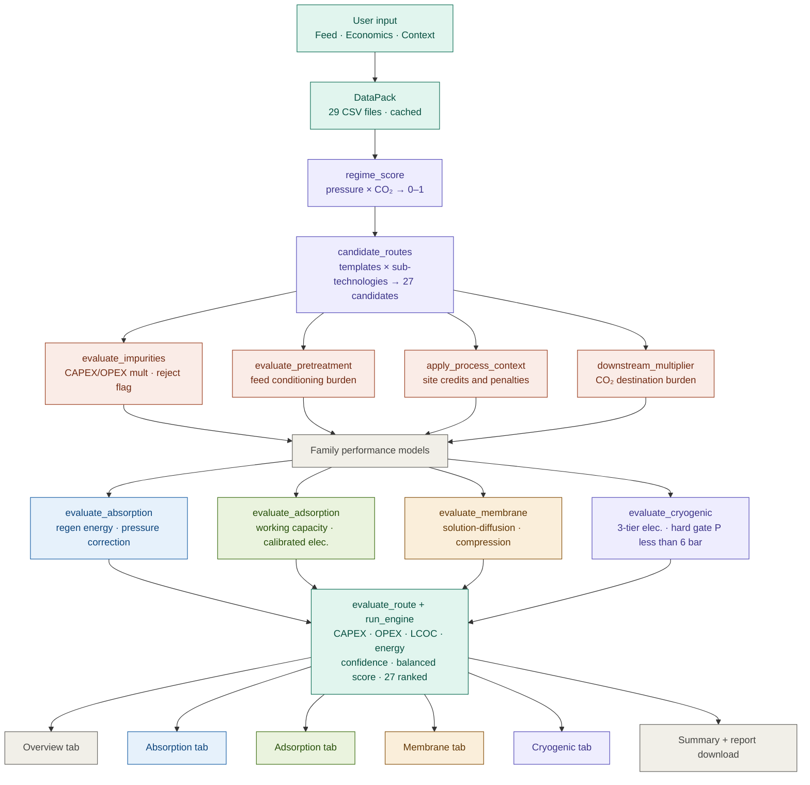

# 🏭 Carbon Capture Technology Screening Tool

[](https://www.python.org/downloads/)
[](https://streamlit.io)
[](LICENSE)
[]()
[]()

### *Route-first pre-FEED screening for industrial CO₂ capture across four technology families*

**Absorption · Adsorption · Membrane · Cryogenic**  
Every parameter traces to a peer-reviewed source. Every result carries a confidence label.

[Quickstart](#-quickstart) · [Theory](#-theoretical-background) · [Validation](#-validation) · [Architecture](#-architecture) · [Database](#-database-v5) · [References](#-references)

---

## 📋 Overview

This tool evaluates CO₂ capture routes across all four major separation families for any industrial feed gas. Given feed composition, operating conditions, and economic parameters, it ranks all feasible routes using a balanced score that combines cost, energy, technical fit, TRL maturity, and confidence — backed by 20+ peer-reviewed TEA studies.

It is designed for **pre-FEED technology selection**: narrowing from four families to one before committing to detailed simulation.

### What it does

| Step | Description |
|------|-------------|
| **Classify regime** | Feed pressure × CO₂ composition → regime fit score per route |
| **Generate candidates** | Route templates × sub-technology options → 27 candidates per run |
| **Evaluate feasibility** | Impurity effects, pretreatment triggers, context flags, downstream requirements |
| **Compute performance** | Family-specific energy/utility models, calibrated to literature |
| **TEA** | Equipment CAPEX scaling + OPEX components → LCOC per route |
| **Score and rank** | Balanced score: 32% cost + 15% energy + 24% fit + 12% TRL + 17% confidence |
| **Report** | Downloadable structured Markdown engineering report |

### Technology families

| Family | Sub-technologies in Database V5 |
|--------|--------------------------------|
| **Absorption** | MEA (TRL 9), MDEA (TRL 9), MDEA+PZ blend (TRL 8), Selexol physical (TRL 9), Rectisol physical (TRL 9) |
| **Adsorption** | Zeolite 13X + PSA/TSA (TRL 9), Activated Carbon + PSA/TSA (TRL 9), Amine Solid sorbent (TRL 7) |
| **Membrane** | Cellulose Acetate (TRL 9), Polysulfone (TRL 9), Polaris-type (TRL 8), Mixed Matrix (TRL 6) — 1- and 2-stage |
| **Cryogenic** | High-CO₂ standalone (TRL 8), cryo polishing (TRL 7), membrane-cryo hybrid (TRL 6) |

---

## 🚀 Quickstart

### Installation

```bash
git clone https://github.com/<your-username>/carbon-capture-screening.git
cd carbon-capture-screening
pip install -r requirements.txt
```

### Run the app

```bash
streamlit run carbon_capture_app_v1_8_8.py
```

Place `carbon_capture_master_data_pack_v5/` next to the script, or:

```bash
export CC_DATA_PACK=/path/to/carbon_capture_master_data_pack_v5
streamlit run carbon_capture_app_v1_8_8.py
```

### Programmatic example — cement plant

```python
from carbon_capture_app_v1_8_8 import DataPack, FeedCase, Economics, run_engine
from pathlib import Path

db = DataPack(Path("carbon_capture_master_data_pack_v5"))

# Cement kiln post-combustion flue gas (Roussanaly 2017 basis)
feed = FeedCase(
    source_id="SRC_CEMENT", source_name="cement_flue_gas",
    flow_nm3_h=100_000,  pressure_bar=1.1,  temperature_c=120,
    co2_mol_pct=24.0,    h2_mol_pct=0.0,    n2_mol_pct=70.0,
    ch4_mol_pct=1.0,     co_mol_pct=0.0,    h2o_mol_pct=5.0,
    capture_target_pct=90.0,  product_purity_pct=95.0,
    impurities={"O2":3.5, "H2S":0, "SOx":50, "NOx":100,
                "HCl":5, "NH3":0, "Particulates":10, "HeavyHC":0},
    process_context={"steam_available":"yes", "co2_destination":"storage"},
)

econ = Economics(
    carbon_price_eur_t=85,  electricity_eur_mwh=85,  heat_eur_gj=15,
    cooling_eur_m3=0.05,    labor_eur_y=180_000,
    discount_rate_pct=8,    life_years=25,
    maintenance_pct_capex=3, contingency_pct=15,  op_hours=8000,
)

results = run_engine(db, feed, econ)
top = results[0]
print(f"Winner : {top['family']} — {top['option_name']}")
print(f"LCOC   : €{top['lcoc_eur_t']:.1f}/tCO₂")
print(f"Energy : {top['energy_gj_t']:.2f} GJ/tCO₂")
print(f"Conf.  : {top['confidence_label']}")
# → Winner : absorption — MEA
# → LCOC   : €82.4/tCO₂   (literature: €83/t, Roussanaly 2017 GHGT-13)
# → Energy : 2.01 GJ/tCO₂
# → Conf.  : High
```

---

## 📈 Validation

Spot-check results from 500-case stress testing against peer-reviewed anchors:

| Case | Tool | Literature | Source | Status |
|------|------|-----------|--------|--------|
| MEA, cement 24% CO₂, 1.1 bar, 90% capture | ~€82–85/t | **€83/t** avoided | Roussanaly et al. 2017, *Energy Procedia* GHGT-13 | ✅ |
| AMP-PZ-MEA, cement 1.5 Mt/y | ~€68–74/t | **USD 77/t** (≈€66) | Nwaoha et al. 2018, *IJGGC* | ✅ |
| Selexol/ADIP-X, SMR 18% CO₂, 20 bar | ~€40–45/t | **€41/t** avoided | Meerman et al. 2012, *IJGGC* | ✅ |
| Cryogenic, cement 90% capture, electricity | 0.33 MWh/tCO₂ | **1.19 MJ/kgCO₂** = 0.331 MWh/t | Varnier et al. 2025, *Cleaner Eng. Technol.* | ✅ |
| CEMCAP MEA reference | ~€80/t | **€80/t** | Voldsund et al. 2019, *Energies* 12, 542 | ✅ |
| SEWGS reference sorbent, NGCC | ~€55–60/t | **€58/t** | van Selow et al. 2013, *IJGGC* | ✅ |
| Calcium looping, tail-end cement | ~€50–56/t | **€52/t** | De Lena et al. 2019, *IJGGC* | ✅ |

**Amine comparison at cement conditions** (24% CO₂, 1.1 bar):

| Option | LCOC range | Energy | Confidence | Literature |
|--------|-----------|--------|------------|------------|
| MEA | €80–85/t | 2.0–2.1 GJ/t | High | Roussanaly 2017; Nwaoha 2018 |
| AMP-PZ-MEA | €68–74/t | 1.8–1.9 GJ/t | High | Nwaoha 2018 |
| DMX phase-change | €55–65/t | 1.8–2.0 GJ/t | Moderate | Le Moullec 2017; IFPEN 2021 |
| Selexol (physical) | penalised out | — | Low | pCO₂ = 0.26 bar < 3 bar minimum |
| Cryogenic | excluded | — | — | P < 6 bar hard gate |

---

## 🏗 Architecture



Full walkthrough in [`docs/ARCHITECTURE.md`](docs/ARCHITECTURE.md).

---

## 📐 Theoretical Background

### Regime scoring

Feed pressure and CO₂ concentration determine which routes are in their natural operating window:

| Regime | Window condition | In-window score | Out-of-window |
|--------|-----------------|-----------------|---------------|
| `low_pressure_flue_gas` | P ≤ 2 bar AND CO₂ ≤ 30% | 1.0 | 0.60 |
| `high_pressure_precombustion_or_sweetening` | P ≥ 8 bar AND CO₂ ≥ 15% | 1.0 | 0.45 |
| `moderate_pressure_dry_gas` | P ≥ 3 bar, H₂O ≤ 3%, 8% ≤ CO₂ ≤ 50% | 1.0 | 0.55 |
| `niche_high_co2_high_pressure` | P ≥ 8 bar AND CO₂ ≥ 25% | 1.0 | 0.20 |

*Basis: Concawe 2025 pCO₂ applicability guidance; Meerman 2012 high-pressure benchmark*

### Absorption

Regeneration energy (mid-point of database range, Kohl & Nielsen 1997 framework):

$$Q_{\text{regen}} = \frac{Q_{\min} + Q_{\max}}{2}$$

Physical solvent pressure correction (Meerman 2012 calibration):

$$Q_{\text{phys}} = Q_{\text{regen}} \times \begin{cases} 0.85 & p_{\text{CO}_2} \geq 3\text{ bar} \;\;(P \geq 8\text{ bar, CO}_2 \geq 15\%) \\ 1.45 & \text{otherwise} \end{cases}$$

Database solvent values:

| Solvent | Q_min (GJ/t) | Q_max (GJ/t) | TRL |
|---------|-------------|-------------|-----|
| MEA | 3.5 | 4.2 | 9 |
| MDEA | 2.2 | 3.0 | 9 |
| MDEA+PZ | 2.4 | 3.0 | 8 |
| Selexol | 0.8 | 1.5 | 9 |
| Rectisol | 0.5 | 1.2 | 9 |

### Adsorption specific electricity

Calibrated to literature (Chisalita 2024 TNO; Riboldi 2017 review):

| Swing mode | Range (MWh/tCO₂) | Base |
|------------|-----------------|------|
| PSA | 0.35–0.55 | 0.42 |
| TSA | 0.45–0.70 | 0.55 |
| VSA/PVSA | 0.50–0.85 | 0.62 |

Moisture correction to working capacity (Riboldi 2017):

$$q_{\text{eff}} = q_{\text{mid}} \times \begin{cases} 0.55 & \text{high sensitivity, H}_2\text{O} > 3\% \\ 0.75 & \text{medium sensitivity, H}_2\text{O} > 5\% \\ 1.00 & \text{otherwise} \end{cases}$$

### Membrane — solution-diffusion model

Permeate CO₂ mole fraction (Wijmans & Baker 1995):

$$y_{\text{perm}} = \frac{\alpha \cdot x_{\text{CO}_2}}{1 + (\alpha - 1)\,x_{\text{CO}_2}}$$

Compression electricity (log-mean pressure ratio basis):

$$W_{\text{elec}} = \dot{m}_{\text{cap}} \cdot \left(0.25 + 0.12\ln\!\left(\max\!\left(1.1,\,\frac{8}{P}\right)\right) + 0.12\cdot\mathbf{1}_{\text{2-stage}}\right)$$

### Cryogenic — three-tier electricity model

Anchored to Varnier et al. 2025 (1.19 MJ/kgCO₂ = 0.331 MWh/tCO₂ at cement 90% capture):

| Tier condition | MWh/tCO₂ | Basis |
|----------------|----------|-------|
| P ≥ 12 bar, CO₂ ≥ 40%, dry | **0.38** | Varnier 2025 extrapolated; IEAGHG oxyfuel CPU |
| P ≥ 8 bar, CO₂ ≥ 25% | **0.58** | CEMCAP membrane-assisted liquefaction |
| All other feasible cases | **0.90** | Varnier 2025 cement atmospheric |

**Hard gate: excluded if P < 6 bar** (no literature shows cryogenic winning at atmospheric pressure).

### LCOC

$$\text{LCOC} = \frac{\text{CRF}(d, n) \cdot C_{\text{CAPEX}} + C_{\text{OPEX}}}{\dot{m}_{\text{CO}_2,\text{annual}}}$$

$$\text{CRF}(d,n) = \frac{d(1+d)^n}{(1+d)^n - 1}$$

CAPEX includes impurity, pretreatment, context, and downstream multipliers read from database CSV files. OPEX includes electricity, heat, cooling, solvent/sorbent replacement, maintenance, and labor.

### Confidence scoring

$$C = \text{clip}\!\left(65 + \sum_i\Delta_i,\; 5,\; 95\right)$$

| Signal | Δ |
|--------|---|
| In preferred regime window (score ≥ 0.75) | +8 |
| Out of window | −6 |
| Benchmark distance < 0.2 | +8 |
| Benchmark distance > 0.6 | −8 |
| TRL ≥ 8 | +8 |
| TRL = 7 | +4 |
| TRL ≤ 6 | −6 |
| Purity shortfall | −5 |
| Regime score < 0.5 | −8 |

**High ≥ 75 · Moderate ≥ 55 · Low < 55** — maximum achievable = 89 (High is reachable).

Full derivations in [`docs/THEORY.md`](docs/THEORY.md).

---

## 🗂 Database V5

29 CSV files — every parameter references `references_master.csv` (DOI-traceable):

| Category | Files |
|----------|-------|
| Feed sources | `feed_sources.csv`, `feed_source_representative_cases.csv` |
| Technology libraries | `absorption_solvents.csv`, `adsorbents.csv`, `membranes.csv`, `cryogenic_configs.csv`, `swing_modes.csv` |
| Route structure | `route_templates.csv`, `route_equipment_map.csv` |
| Equipment costs | `equipment_classes.csv`, `equipment_cost_anchors.csv`, `equipment_scaling_rules.csv` |
| Utilities & consumables | `utility_mapping.csv`, `replacement_consumables.csv` |
| Feasibility logic | `impurity_effects.csv`, `pretreatment_rules.csv`, `post_treatment_rules.csv`, `process_context_rules.csv`, `downstream_handling_rules.csv` |
| TEA anchors | `tea_cost_anchors.csv`, `tea_normalization_rules.csv`, `scope_boundary_definitions.csv`, `study_scope_mapping.csv` |
| Benchmarks & validation | `benchmark_cases.csv`, `benchmark_case_tags.csv`, `validation_sets.csv`, `confidence_rules.csv` |
| Product specs | `product_spec_targets.csv`, `species_properties.csv` |

Full schema and column definitions in [`docs/DATABASE.md`](docs/DATABASE.md).

---

## 📁 Repository layout

```
carbon-capture-screening/
├── README.md
├── LICENSE                           MIT
├── CITATION.cff                      academic citation
├── requirements.txt
├── .gitignore
├── carbon_capture_app_v1_8_8.py      main Streamlit app  (~1758 lines)
├── carbon_capture_master_data_pack_v5/
│   ├── engineering_backbone/          29 CSV files
│   ├── tea_literature/                TEA study metadata + extracted metrics
│   ├── references_master.csv          all references with DOI locators
│   ├── MANIFEST.csv
│   └── README.txt
└── docs/
    ├── THEORY.md                      equations with full literature derivations
    ├── ARCHITECTURE.md                code module walkthrough
    ├── DATABASE.md                    schema and column definitions
    └── VALIDATION.md                  spot-check results vs literature
```

---

## ⚠️ Limitations

- Pre-FEED accuracy ±30–40%. Not for investment decisions, procurement, or FEED.
- No dynamic simulation, column hydraulics, or rigorous thermodynamic VLE.
- Cryogenic calibrated only to high-CO₂/high-pressure niche (≥ 20% CO₂, ≥ 6 bar).
- Physical solvent results at borderline pCO₂ (2–4 bar) carry the highest model uncertainty.
- All CAPEX uses six-tenths rule from 2019–2022 European cost bases; no regional adjustment.
- Membrane model assumes ideal solution-diffusion; no plasticization or aging effects.

---

## 📖 References

**Absorption**
- Roussanaly et al. *Energy Procedia* **114**, 6683–6696 (2017) — MEA cement €83/t [GHGT-13]
- Nwaoha et al. *Int. J. Greenhouse Gas Control* **78**, 362–375 (2018) — AMP-PZ-MEA vs MEA
- Meerman et al. *Int. J. Greenhouse Gas Control* **11**, 58–73 (2012) — Selexol SMR €41/t
- Le Moullec et al. *Energy Procedia* **114**, 6472–6481 (2017) — DMX benchmarking
- van Selow et al. *Int. J. Greenhouse Gas Control* **14**, 209–220 (2013) — SEWGS €49–58/t
- Kohl, A. L. & Nielsen, R. B. *Gas Purification*, 5th ed., Gulf Publishing (1997)

**Adsorption**
- Chisalita et al. *Ind. Eng. Chem. Res.* **63** (2024) — monolithic 13X/AC structured TEA (TNO)
- Riboldi & Bolland *Energy Procedia* **114**, 2016–2025 (2017) — PSA/VSA/TSA review (319 citations)
- De Lena et al. *Int. J. Greenhouse Gas Control* **82**, 244–260 (2019) — calcium looping €52–58/t

**Membrane**
- Wijmans, J. G. & Baker, R. W. *J. Membr. Sci.* **107**, 1–21 (1995) — solution-diffusion model
- Bouma et al. *Energy Procedia* **114**, 55–65 (2017) — membrane-cryo hybrid cement (TNO)
- Concawe (2025) Report 25/11 — cross-technology applicability

**Cryogenic**
- Varnier et al. *Cleaner Eng. Technol.* (2025) — cryogenic cement 1.19 MJ/kgCO₂ at 90%
- Voldsund et al. *Energies* **12**, 542 (2019) — CEMCAP comparative €42–84/t

**Equipment cost bases**
- Peters, M. S. & Timmerhaus, K. D. *Plant Design and Economics for Chemical Engineers*, 5th ed., McGraw-Hill (2003)
- NETL (2023) *Cost of Capturing CO₂ from Industrial Sources* — [DOE/NETL report](https://netl.doe.gov/projects/files/CostofCapturingCO2fromIndustrialSources_033123.pdf)
- NETL (2019) *QGESS CO₂ Transport and Storage Costs* — [DOE/NETL QGESS](https://netl.doe.gov/projects/files/QGESSCarbonDioxideTransportandStorageCostsinNETLStudies_081919.pdf)

---

## 📝 Citation

```bibtex
@software{panangadan_cc_screening_2026,
  author  = {Panangadantakath, Haroon Al Kasim},
  title   = {Carbon Capture Technology Screening Tool},
  year    = {2026},
  url     = {https://github.com/<your-username>/carbon-capture-screening},
  note    = {Route-first pre-FEED screening across absorption, adsorption,
             membrane and cryogenic families. Database V5 backed by 20+
             peer-reviewed TEA studies. Validated: MEA cement €83/t
             (Roussanaly 2017), Selexol SMR €41/t (Meerman 2012),
             cryogenic cement 0.33 MWh/t (Varnier 2025).}
}
```

---

## 📜 License

MIT — see [LICENSE](LICENSE).

---

## 👤 Author

**Haroon Al Kasim Panangadantakath** — Process Engineer | Carbon Capture & Industrial Decarbonisation

> *"Pick the right technology family before you run the simulation."*

⭐ Star this repo if it helps your work.
