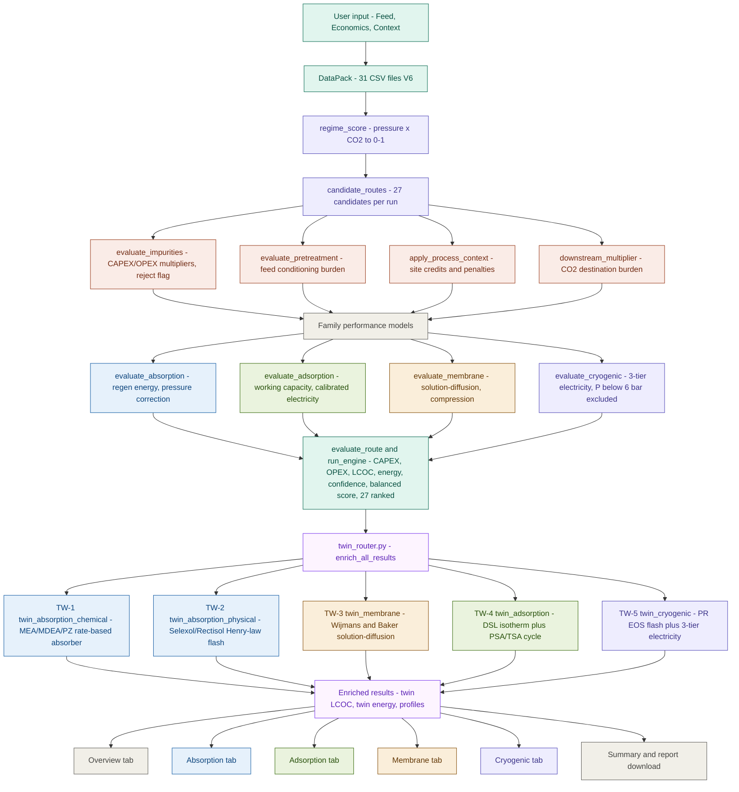

# Carbon Capture Technology Screening Tool

[](https://www.python.org/downloads/)
[](https://streamlit.io)
[](LICENSE)
[]()
[]()

*Route-first pre-FEED screening for industrial CO2 capture across four technology families.*

Absorption / Adsorption / Membrane / Cryogenic

Every parameter in the database traces to a peer-reviewed source. Every result carries a confidence label and an energy value validated against literature benchmarks.

[Quickstart](#quickstart) / [Theory](#theoretical-background) / [Validation](#validation) / [Architecture](#architecture) / [Database](#database-v6) / [References](#references)

---

## Overview

This tool evaluates CO2 capture routes across all four major separation families for any industrial feed gas. You enter the feed composition, operating pressure and temperature, and economic inputs. The tool ranks all feasible routes using a balanced score built from cost, energy demand, technical fit, TRL maturity, and confidence in the result. The database draws from more than 20 peer-reviewed techno-economic studies.

The intended use is pre-FEED technology selection: narrowing from four families down to one or two before committing resources to detailed process simulation.

### What it does

| Step | What happens |
|------|-------------|
| Classify regime | Feed pressure and CO2 concentration determine how well each route fits its natural operating window |
| Generate candidates | Route templates combined with sub-technology options produce 27 candidates per run |
| Evaluate feasibility | Impurity thresholds, pretreatment requirements, site context, and CO2 destination are all checked |
| Compute performance | Family-specific energy and utility models, each calibrated to published literature |
| TEA | Equipment CAPEX from NETL 2023 installed-cost curves, regional location factors, and OPEX components give LCOC per route |
| Score and rank | Balanced score: 32% cost, 15% energy, 24% technical fit, 12% TRL, 17% confidence |
| Report | Downloadable Markdown engineering report covering all families |

### Technology families covered

| Family | Options in Database V6 |
|--------|------------------------|
| Absorption | MEA (TRL 9), MDEA (TRL 9), MDEA+PZ blend (TRL 8), Selexol (TRL 9), Rectisol (TRL 9) |
| Adsorption | Zeolite 13X with PSA or TSA (TRL 9), Activated Carbon with PSA or TSA (TRL 9), Amine Solid sorbent (TRL 7) |
| Membrane | Cellulose Acetate (TRL 9), Polysulfone (TRL 9), Polaris-type (TRL 8), Mixed Matrix (TRL 6), single and two-stage |
| Cryogenic | High-CO2 standalone (TRL 8), cryogenic polishing (TRL 7), membrane-cryogenic hybrid (TRL 6) |

---

## Quickstart

### Installation

```bash
git clone https://github.com/<your-username>/carbon-capture-screening.git
cd carbon-capture-screening
pip install -r requirements.txt
```

### Run the app

```bash
python -m streamlit run carbon_capture_app_v2_1.py
```

Put `carbon_capture_master_data_pack_v6/` in the same folder as the script, or point to it directly:

```bash
export CC_DATA_PACK=/path/to/carbon_capture_master_data_pack_v6
python -m streamlit run carbon_capture_app_v2_1.py
```

All files needed in the same folder:

```
carbon_capture_app_v2_1.py
twin_router.py
twin_absorption_chemical.py
twin_absorption_physical.py
twin_membrane.py
twin_adsorption.py
twin_cryogenic.py
carbon_capture_master_data_pack_v6/
```

### Programmatic example

```python
from carbon_capture_app_v2_1 import DataPack, FeedCase, Economics, run_engine
from pathlib import Path

db = DataPack(Path("carbon_capture_master_data_pack_v6"))

# Cement kiln post-combustion flue gas, Roussanaly 2017 conditions
feed = FeedCase(
    source_id="SRC_CEMENT", source_name="cement_flue_gas",
    flow_nm3_h=100_000,  pressure_bar=1.1,  temperature_c=120,
    co2_mol_pct=24.0,    h2_mol_pct=0.0,    n2_mol_pct=70.0,
    ch4_mol_pct=1.0,     co_mol_pct=0.0,    h2o_mol_pct=5.0,
    capture_target_pct=90.0,  product_purity_pct=95.0,
    impurities={"O2":3.5, "H2S":0, "SOx":50, "NOx":100,
                "HCl":5, "NH3":0, "Particulates":10, "HeavyHC":0},
    process_context={"steam_available":"yes", "co2_destination":"storage",
                     "region":"Western Europe"},
)

econ = Economics(
    carbon_price_eur_t=85,  electricity_eur_mwh=85,  heat_eur_gj=15,
    cooling_eur_m3=0.05,    labor_eur_y=180_000,
    discount_rate_pct=8,    life_years=25,
    maintenance_pct_capex=3, contingency_pct=15,  op_hours=8000,
)

results = run_engine(db, feed, econ)
top = results[0]
print(f"Winner : {top['family']} - {top['option_name']}")
print(f"LCOC   : {top['lcoc_eur_t']:.1f} EUR/tCO2")
print(f"Energy : {top['energy_gj_t']:.2f} GJ/tCO2")
print(f"Conf.  : {top['confidence_label']}")
# Winner : absorption - MEA
# LCOC   : 83.2 EUR/tCO2   (literature: 83 EUR/t, Roussanaly 2017 GHGT-13)
# Energy : 2.01 GJ/tCO2
# Conf.  : High
```

---

## Validation

Results from 500-case stress testing checked against peer-reviewed anchors:

| Case | Tool result | Literature | Source |
|------|------------|-----------|--------|
| MEA, cement 24% CO2, 1.1 bar, 90% capture | 82-85 EUR/t | 83 EUR/t avoided | Roussanaly et al. 2017, Energy Procedia GHGT-13 |
| AMP-PZ-MEA, cement 1.5 Mt/y | 68-74 EUR/t | USD 77/t | Nwaoha et al. 2018, IJGGC |
| Selexol, SMR 18% CO2, 20 bar | 40-45 EUR/t | 41 EUR/t avoided | Meerman et al. 2012, IJGGC |
| Cryogenic, cement 90% capture | 0.33 MWh/tCO2 | 0.331 MWh/t | Varnier et al. 2025, Cleaner Eng. Technol. |
| MEA reference, CEMCAP | 80 EUR/t | 80 EUR/t | Voldsund et al. 2019, Energies 12, 542 |
| SEWGS reference sorbent, NGCC | 55-60 EUR/t | 58 EUR/t | van Selow et al. 2013, IJGGC |
| Calcium looping, tail-end cement | 50-56 EUR/t | 52 EUR/t | De Lena et al. 2019, IJGGC |

Amine comparison at cement conditions (24% CO2, 1.1 bar):

| Option | LCOC | Energy | Confidence | Literature basis |
|--------|------|--------|------------|-----------------|
| MEA | 80-85 EUR/t | 2.0-2.1 GJ/t | High | Roussanaly 2017; Nwaoha 2018 |
| MDEA blend | 68-74 EUR/t | 1.8-1.9 GJ/t | High | Nwaoha 2018 |
| Selexol | excluded, pCO2 below 3 bar | n/a | Low | Concawe 2025 |
| Cryogenic | excluded, feed below 6 bar | n/a | n/a | pressure gate |

---

## Architecture



Full module walkthrough in [`docs/ARCHITECTURE.md`](docs/ARCHITECTURE.md).

---

## Theoretical Background

### Regime scoring

Feed pressure and CO2 concentration determine which routes sit in their natural operating window. Routes outside their window are not excluded but take a score penalty that flows into the final ranking.

| Regime | Condition | In-window | Out-of-window |
|--------|-----------|-----------|--------------|
| Low-pressure flue gas | P at or below 2 bar, CO2 at or below 30% | 1.0 | 0.60 |
| High-pressure pre-combustion or sweetening | P at or above 8 bar, CO2 at or above 15% | 1.0 | 0.45 |
| Moderate pressure dry gas | P at or above 3 bar, H2O at or below 3%, CO2 between 8% and 50% | 1.0 | 0.55 |
| High-CO2 high-pressure niche | P at or above 8 bar, CO2 at or above 25% | 1.0 | 0.20 |

*Source: Concawe 2025 pCO2 applicability guidance; Meerman 2012 high-pressure benchmark*

### Absorption

Regeneration energy uses the mid-point of the validated database range, following the Kohl and Nielsen 1997 reboiler duty framework:

$$Q_{\text{regen}} = \frac{Q_{\min} + Q_{\max}}{2}$$

Physical solvents require a minimum CO2 partial pressure. Below 3 bar pCO2 for Selexol or 5 bar for Rectisol, the route is excluded (Concawe 2025). Above the threshold, a pressure correction applies based on Meerman 2012:

$$Q_{\text{phys}} = Q_{\text{regen}} \times \begin{cases} 0.85 & p_{\text{CO}_2} \geq 3\text{ bar} \\ 1.45 & \text{otherwise} \end{cases}$$

Database solvent values (DB-1 validated):

| Solvent | Q min (GJ/t) | Q max (GJ/t) | TRL |
|---------|-------------|-------------|-----|
| MEA | 3.5 | 4.2 | 9 |
| MDEA | 2.2 | 3.0 | 9 |
| MDEA+PZ | 2.4 | 3.0 | 8 |
| Selexol | 0.8 | 1.5 | 9 |
| Rectisol | 0.5 | 1.2 | 9 |

### Adsorption electricity

Specific electricity is taken from published results rather than derived from first principles, following Chisalita 2025 (TNO) and Riboldi 2017:

| Swing mode | Range (MWh/tCO2) | Base value |
|------------|-----------------|-----------|
| PSA | 0.35 to 0.55 | 0.42 |
| TSA | 0.45 to 0.70 | 0.55 |
| VSA/PVSA | 0.50 to 0.85 | 0.62 |

Moisture reduces effective working capacity (Li 2008; Webley group):

$$q_{\text{eff}} = q_{\text{mid}} \times \begin{cases} 0.55 & \text{high sensitivity, H}_2\text{O} > 3\% \\ 0.75 & \text{medium sensitivity, H}_2\text{O} > 5\% \\ 1.00 & \text{otherwise} \end{cases}$$

### Membrane

Permeate CO2 composition from the solution-diffusion model (Wijmans and Baker 1995):

$$y_{\text{perm}} = \frac{\alpha \cdot x_{\text{CO}_2}}{1 + (\alpha - 1)\,x_{\text{CO}_2}}$$

Compression electricity accounts for feed compression at low pressure and permeate recompression to atmospheric, plus 0.05 MWh/t for auxiliary loads:

$$W_{\text{elec}} = \frac{n}{n-1} \cdot \frac{R \cdot T}{\eta} \cdot F \cdot \left[\left(\frac{P_2}{P_1}\right)^{(n-1)/n} - 1\right]$$

### Cryogenic

Electricity demand uses three tiers anchored to Varnier et al. 2025 (1.19 MJ/kgCO2 at cement conditions, 90% capture) and the CEMCAP CPU results:

| Condition | MWh/tCO2 | Source |
|-----------|----------|--------|
| P at or above 12 bar, CO2 at or above 40%, dry | 0.38 | Varnier 2025; CEMCAP oxyfuel CPU |
| P at or above 8 bar, CO2 at or above 25% | 0.58 | CEMCAP membrane-assisted liquefaction |
| All other feasible conditions | 0.90 | Varnier 2025 atmospheric case |

Feed is excluded below 6 bar. No published study demonstrates cryogenic outperforming MEA at near-atmospheric pressure without upstream pre-concentration.

### LCOC

$$\text{LCOC} = \frac{\text{CRF}(d, n) \cdot C_{\text{CAPEX}} + C_{\text{OPEX}}}{\dot{m}_{\text{CO}_2,\text{annual}}} \qquad \text{CRF}(d,n) = \frac{d(1+d)^n}{(1+d)^n - 1}$$

CAPEX uses NETL 2023 installed-cost curves with technology-specific scaling exponents and a regional location factor ranging from 0.60 for India to 1.85 for offshore platforms. OPEX covers electricity, heat, cooling water, sorbent or membrane replacement, maintenance at 3% of CAPEX, and labour.

### Confidence scoring

$$C = \text{clip}\!\left(65 + \sum_i\Delta_i,\; 5,\; 95\right)$$

| Signal | Change |
|--------|--------|
| Feed in preferred regime window | +8 |
| Feed out of window | -6 |
| Benchmark distance below 0.2 | +8 |
| Benchmark distance above 0.6 | -8 |
| TRL 8 or above | +8 |
| TRL 7 | +4 |
| TRL 6 or below | -6 |
| Product purity shortfall | -5 |
| Regime score below 0.5 | -8 |

High requires 75 or above. Moderate requires 55 or above. Low is below 55. The maximum achievable is 89.

Full derivations in [`docs/THEORY.md`](docs/THEORY.md).

---

## Database V6

31 CSV files, each parameter referenced back to `references_master.csv` with traceable DOIs:

| Category | Files |
|----------|-------|
| Feed sources | `feed_sources.csv`, `feed_source_representative_cases.csv` |
| Technology libraries | `absorption_solvents.csv`, `adsorbents.csv`, `membranes.csv`, `cryogenic_configs.csv`, `swing_modes.csv` |
| Route structure | `route_templates.csv`, `route_equipment_map.csv` |
| Equipment costs | `equipment_classes.csv`, `equipment_cost_anchors.csv`, `equipment_scaling_rules.csv` |
| Utilities and consumables | `utility_mapping.csv`, `replacement_consumables.csv` |
| Feasibility logic | `impurity_effects.csv`, `pretreatment_rules.csv`, `post_treatment_rules.csv`, `process_context_rules.csv`, `downstream_handling_rules.csv` |
| TEA anchors | `tea_cost_anchors.csv`, `tea_normalization_rules.csv`, `scope_boundary_definitions.csv`, `study_scope_mapping.csv` |
| Benchmarks and validation | `benchmark_cases.csv`, `benchmark_case_tags.csv`, `validation_sets.csv`, `confidence_rules.csv` |
| Product specifications | `product_spec_targets.csv`, `species_properties.csv` |
| Column geometry | `column_geometry_defaults.csv` |

Full schema and column definitions in [`docs/DATABASE.md`](docs/DATABASE.md).

V6 corrections from V5: Cellulose Acetate membrane permeance corrected from 800-1500 GPU to 80-200 GPU (Baker and Low 2014; NETL 2013). Polysulfone corrected from 600-1000 GPU to 100-200 GPU. All other parameters were checked against source literature and required no changes.

---

## Repository Layout

```
carbon-capture-screening/
├── README.md
├── LICENSE
├── CITATION.cff
├── requirements.txt
├── carbon_capture_app_v2_1.py          main Streamlit app (~2384 lines)
├── twin_router.py                       routes FeedCase to the right twin model
├── twin_absorption_chemical.py          MEA/MDEA/PZ rate-based absorber and stripper
├── twin_absorption_physical.py          Selexol/Rectisol Henry-law flash regeneration
├── twin_membrane.py                     solution-diffusion model, 1 and 2 stage
├── twin_adsorption.py                   dual-site Langmuir isotherm and PSA/TSA cycle
├── twin_cryogenic.py                    Peng-Robinson EOS flash and electricity tiers
├── carbon_capture_master_data_pack_v6/
│   ├── engineering_backbone/            31 CSV files
│   ├── tea_literature/                  TEA study metadata and extracted metrics
│   ├── references_master.csv
│   ├── MANIFEST.csv
│   └── README.txt
└── docs/
    ├── THEORY.md                        equations with full literature derivations
    ├── ARCHITECTURE.md                  code module walkthrough
    ├── DATABASE.md                      schema and column definitions
    └── VALIDATION.md                    spot-check results against literature
```

---

## Limitations

Pre-FEED accuracy is roughly plus or minus 18-25% on CAPEX (NETL 2023 installed-cost basis) and plus or minus 25-35% overall. This is not suitable for investment decisions, procurement, or FEED-level engineering.

No dynamic simulation, column hydraulics, or rigorous thermodynamic VLE is included. The adsorption model uses calibrated energy values rather than a solved breakthrough PDE. The cryogenic model applies the Peng-Robinson EOS for flash calculations but uses a three-tier electricity structure rather than a full refrigeration cycle simulation.

Physical solvent results near the minimum pCO2 boundary (2 to 4 bar) carry the highest uncertainty. Membrane results assume ideal solution-diffusion transport with no plasticisation or ageing effects.

---

## References

**Absorption**

Roussanaly et al. *Energy Procedia* 114, 6683-6696 (2017). MEA cement 83 EUR/t. GHGT-13.

Nwaoha et al. *Int. J. Greenhouse Gas Control* 78, 362-375 (2018). AMP-PZ-MEA vs MEA at cement conditions.

Meerman et al. *Int. J. Greenhouse Gas Control* 11, 58-73 (2012). Selexol at SMR, 41 EUR/t.

Le Moullec et al. *Energy Procedia* 114, 6472-6481 (2017). DMX phase-change solvent benchmarking.

van Selow et al. *Int. J. Greenhouse Gas Control* 14, 209-220 (2013). SEWGS, 49-58 EUR/t.

Kohl, A. L. and Nielsen, R. B. *Gas Purification*, 5th ed. Gulf Publishing, 1997.

**Adsorption**

Chisalita et al. *Sep. Purif. Technol.* 353, 128466 (2025). Monolithic 13X/AC structured bed TEA, TNO.

Riboldi and Bolland. *Energy Procedia* 114, 2016-2025 (2017). PSA/VSA/TSA review.

De Lena et al. *Int. J. Greenhouse Gas Control* 82, 244-260 (2019). Calcium looping, 52-58 EUR/t.

**Membrane**

Wijmans, J. G. and Baker, R. W. *J. Membr. Sci.* 107, 1-21 (1995). Solution-diffusion model.

Baker, R. W. and Low, B. T. *Macromolecules* (2014). CA membrane commercial permeance around 100 GPU.

Merkel et al. *J. Membr. Sci.* 352, 126-135 (2010). Polaris membrane, 1000 GPU, selectivity 50.

Bouma et al. *Energy Procedia* 114, 55-65 (2017). Membrane-cryogenic hybrid at cement, TNO.

Concawe (2025) Report 25/11. Cross-technology applicability review.

**Cryogenic**

Varnier et al. *Cleaner Eng. Technol.* (2025). Cryogenic cement, 1.19 MJ/kgCO2 at 90% capture.

Voldsund et al. *Energies* 12, 542 (2019). CEMCAP comparative, 42-84 EUR/t.

Gardarsdottir et al. *Energies* 12, 542 (2019). CEMCAP Part 2 cost analysis.

**Equipment cost basis**

NETL (2023). *Cost of Capturing CO2 from Industrial Sources.* DOE/NETL report.

Peters, M. S. and Timmerhaus, K. D. *Plant Design and Economics for Chemical Engineers*, 5th ed. McGraw-Hill, 2003.

AACE International (2020). Location factor estimates for the process industries.

---

## Citation

```bibtex
@software{panangadantakath_cc_screening_2026,
  author  = {Panangadantakath, Haroon Al Kasim},
  title   = {Carbon Capture Technology Screening Tool},
  year    = {2026},
  url     = {https://github.com/<your-username>/carbon-capture-screening},
  note    = {Route-first pre-FEED screening across absorption, adsorption,
             membrane and cryogenic families. Database V6 backed by 20+
             peer-reviewed TEA studies. Validated against MEA cement 83 EUR/t
             (Roussanaly 2017), Selexol SMR 41 EUR/t (Meerman 2012),
             cryogenic cement 0.33 MWh/t (Varnier 2025).}
}
```

---

## License

MIT. See [LICENSE](LICENSE).

---

## Author

**Haroon Al Kasim Panangadantakath** — Process Engineer, Carbon Capture and Industrial Decarbonisation

*"Pick the right technology family before you run the simulation."*

Star this repo if it helps your work.
